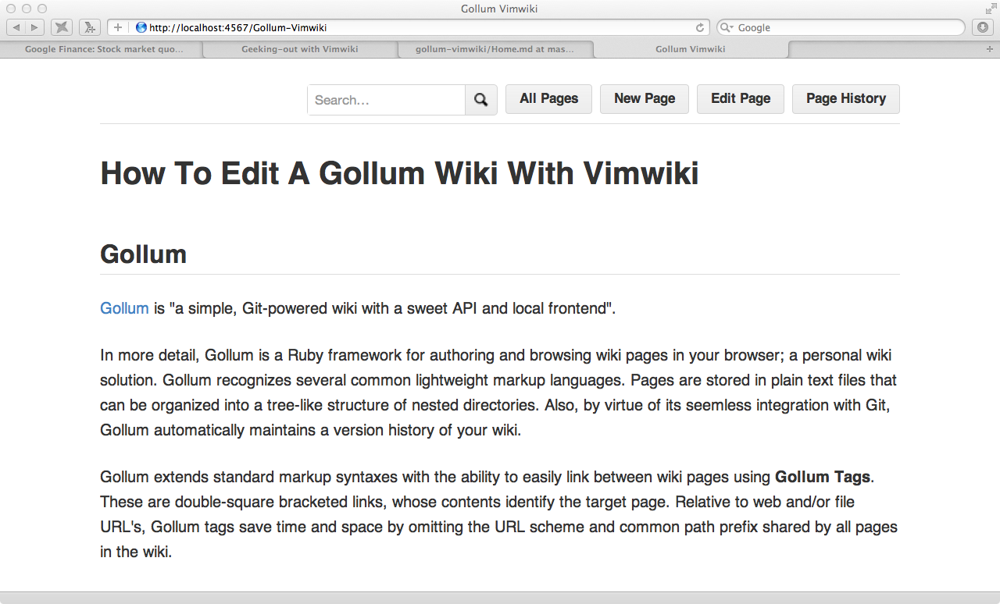
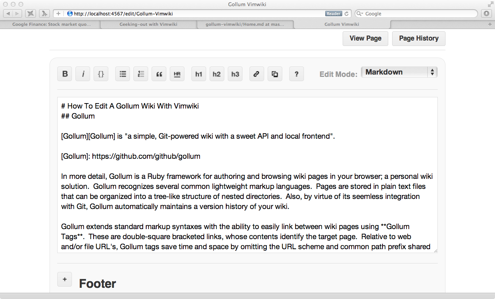
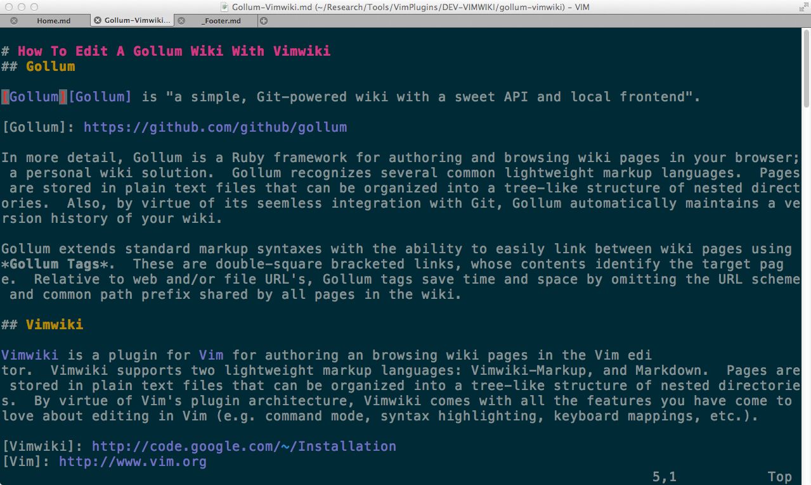

# How To Edit A Gollum Wiki With Vimwiki
## Gollum

[[gollum-vimwiki-1b.png|float|width=300px|align=right]]

[Gollum][Gollum] is "a simple, Git-powered wiki with a sweet API and local frontend".

[Gollum]: https://github.com/github/gollum

In more detail, Gollum is a Ruby framework for authoring and browsing wiki pages in your browser; a personal wiki solution.  Gollum recognizes several common lightweight markup languages.  Pages are stored in plain text files that can be organized into a tree-like structure of nested directories.  Also, by virtue of its seemless integration with Git, Gollum automatically maintains a version history of your wiki.

Gollum extends standard markup syntaxes with the ability to easily link between wiki pages using **Gollum Tags**.  These are double-square-bracketed links, whose contents identify the target page.  Relative to web and/or file URL's, Gollum tags save time and space by omitting the URL scheme and common path prefix shared by all pages in the wiki.

[[gollum-vimwiki-1a.png|float|width=300px|align=right]]

## Vimwiki

[[gollum-vimwiki-2.png|float|width=500px|align=right]]

[Vimwiki][Vimwiki] is a plugin for [Vim][Vim] for authoring an browsing wiki pages in the Vim editor.  Vimwiki supports two lightweight markup languages: Vimwiki-Markup, and Markdown.  Pages are stored in plain text files that can be organized into a tree-like structure of nested directories.  By virtue of Vim's plugin architecture, Vimwiki comes with all the features you have come to love about editing in Vim (e.g. command mode, syntax highlighting, keyboard mappings, etc.).

[Vimwiki]: http://code.google.com/p/vimwiki/wiki/Installation
[Vim]: http://www.vim.org

<!--
[[gollum-vimwiki-1a.png|alt=Gollum-Editing|float|width=300px]]
[[gollum-vimwiki-1b.png|alt=Gollum-Browsing|float|width=300px]]
[[gollum-vimwiki-2.png|alt=Vimwiki-Editing|float|width=300px]]



 -->


# Setup
## 1 Fork Me

``` bash
  git clone https://github.com/tub78/gollum-vimwiki.git
```

## 2 Install Ruby

 * Modern Ruby development

## 3 Install Gollum

The recommended way to install Gollum is with [Bundler][Bundler].  This needs to be installed first.

[Bundler]: http://gembundler.com/

### a) Bundler

Run the following shell script to [install bundler][install-bundler.sh]

``` bash
  gem install bundler
```

### b) Gemfile

A minimal [Gemfile][Gemfile] is required to install Gollum with [Bundler][Bundler].

``` bash
  source "http://rubygems.org"
  gem "gollum"
```

### c) Install 

Run the following shell script to [install gollum.sh][install-gollum.sh]

``` bash
  bundle install --path vendor/bundle
  bundle install --binstubs
  git add Gemfile Gemfile.lock
```


## 4 Install Vimwiki
### Plugin [Installation](http://code.google.com/p/vimwiki/wiki/Installation)


# Viewing 

## Locally

### 1 Run Gollum

``` bash
  cd gollum-vimwiki/
  bin/gollum
```

### 2 Navigate to [http://localhost:4567](http://localhost:4567)


## Github


# 2012-06-25 DONE:

## 2012-06-25 `Trace/BPT trap: 5 gollum`


## 2012-06-24 Publishing on Github

``` bash
  cd existing_git_repo
  git remote add origin https://github.com/tub78/gollum-vimwiki.git
  git push -u origin master
```

## 2012-06-24 Re-use Authentication

``` bash
  ; url = https://github.com/tub78/gollum-vimwiki.git
  url = git@github.com:tub78/gollum-vimwiki.git
```


## 2012-06-24 [difference between a branch fork and clone in git](http://stackoverflow.com/questions/3329943/difference-between-a-branch-fork-and-clone-in-git)


# Repository Contents


 * [./][dotslash]
   * [Gemfile][Gemfile]
   * [Gemfile.lock][Gemfile-lock] **automatically generated file**
   * [install-bundler.sh][install-bundler.sh]
   * [install-gollum.sh][install-gollum.sh]

[dotslash]: ./
[Gemfile]: Gemfile
[Gemfile-lock]: Gemfile.lock
[install-bundler.sh]: install-bundler.sh
[install-gollum.sh]: install-gollum.sh


